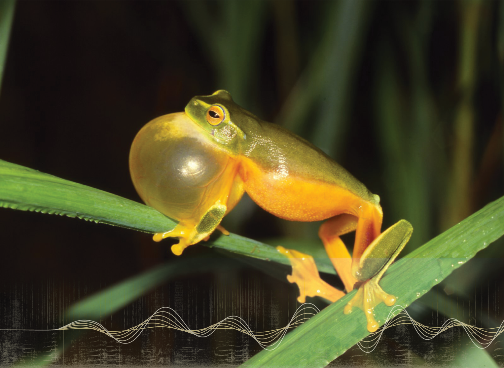

# Case Study


## FrogID: Listening for Frogs at Scale

```{raw} html
<figure style="margin: 0 0 1.25rem;">
  <a href="https://www.earthspecies.org/blog/listening-for-frogs-at-scale-how-frogid-evaluated-naturelm-audio-on-real-world-data" target="_blank" class="figure-link">
    
  </a>
  <figcaption style="font-size: 0.72rem; color: var(--color-foreground-secondary); margin-top: 0.4rem;">Dainty Green Tree Frog. Photo: Gunter Schmida / Courtesy of Australian Museum</figcaption>
</figure>
```

[FrogID](https://www.frogid.net.au/) is a citizen science initiative that has collected over 1.3 million frog call recordings from across Australia. Manually verifying submissions at that scale is a significant bottleneck — NatureLM-audio was evaluated as a tool to automate this process.

The evaluation covered five tasks, from broad classification ("frog vs. not-frog") to fine-grained species identification, with results demonstrating strong performance on real-world citizen science data.

```{raw} html
<a href="https://www.earthspecies.org/blog/listening-for-frogs-at-scale-how-frogid-evaluated-naturelm-audio-on-real-world-data" class="ext-btn" target="_blank" rel="noopener noreferrer">
  Read the full case study
</a>
```
