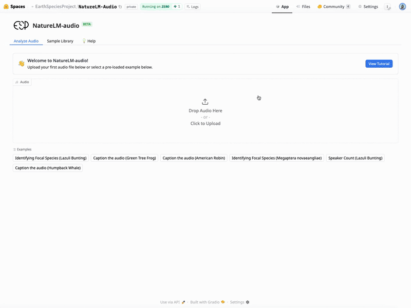

# Interactive Demo

## Try NatureLM-audio

Explore NatureLM-audio with our interactive demo UI. Upload your own audio and run prompts directly in your browser.

```{raw} html
<br />

```

```{raw} html
<a href="https://huggingface.co/spaces/EarthSpeciesProject/NatureLM-Audio" class="ext-btn" target="_blank" rel="noopener noreferrer">
  Launch Demo on Hugging Face Spaces
</a>
```

1. **Load audio:** upload a file or select from the pre-loaded examples. Accepted formats: `.wav`, `.mp3`, `.flac`, `.aac`, `.ogg`, `.aiff`, `.opus`, `.webm`, `.wma`, `.amr`
2. **Trim your clip:** use the scissor icon to trim to 10 seconds or less. Only the first 10 seconds are processed — trim to the section you want analyzed.
3. **Select or ask a question:** choose from pre-configured tasks in the dropdown to auto-fill the prompt, or type your own.
4. **Submit and explore:** press Send to process. Follow-up questions are supported. Use Clear to start over with a new file.
